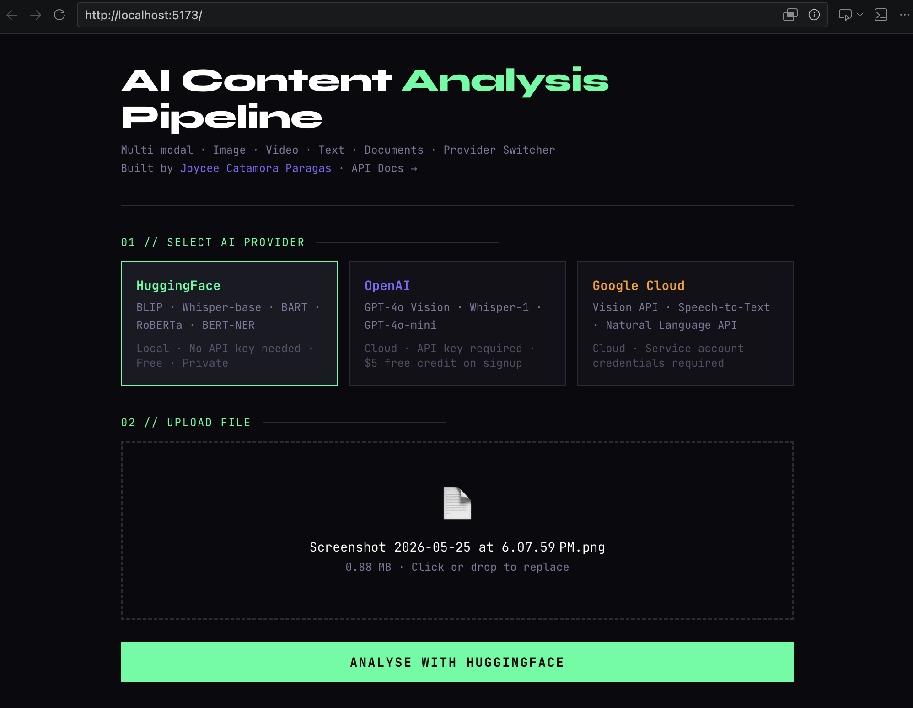

# 🤖 Multi-Modal AI Content Analysis Pipeline

> **Portfolio Project** by [Joycee Catamora Paragas](https://joycee.dev)  
> A production-grade multi-modal AI pipeline for automated content classification and search indexing 
> **Stack:** Python · FastAPI · React · Vite · Tailwind CSS · OpenAI · Google Cloud · HuggingFace

---

## What This Does

A full-stack AI pipeline that automatically analyses:

| Input | What it extracts |
|-------|-----------------|
| 🖼️ **Images** | Labels, objects, OCR text, dominant colours, scene description |
| 🎬 **Videos** | Full transcript, timestamped segments, tags, summary |
| 📄 **Text / Docs** | Summary, sentiment, named entities, keywords, topics |

This replicates the system built at Extreme Reach UK that removed manual asset
transcription and indexing — delivering search results **40% faster**.



---

## Project Structure

```
ai-content-pipeline/
├── backend/                    ← Python / FastAPI
│   ├── src/
│   │   ├── main.py             ← App entry point, all routes
│   │   ├── config.py           ← Settings from .env
│   │   ├── providers/
│   │   │   ├── base.py         ← Abstract interface all providers implement
│   │   │   ├── __init__.py     ← Provider factory: get_provider(name)
│   │   │   ├── openai_provider.py
│   │   │   ├── google_provider.py
│   │   │   └── huggingface_provider.py
│   │   ├── models/
│   │   │   └── schemas.py      ← All Pydantic request/response models
│   │   └── utils/
│   │       ├── file_handler.py ← Upload validation, temp storage, cleanup
│   │       └── logger.py       ← Structured logging setup
│   ├── requirements.txt
│   └── .env.example
│
├── frontend/                   ← React / Vite / Tailwind
│   ├── src/
│   │   ├── main.tsx            ← React entry point
│   │   ├── App.tsx             ← Root component, layout
│   │   ├── components/
│   │   │   ├── ProviderSelector.tsx   ← Provider switcher cards
│   │   │   ├── DropZone.tsx           ← File drag-and-drop upload
│   │   │   ├── AnalyseButton.tsx      ← Submit + loading state
│   │   │   ├── ResultsPanel.tsx       ← Result router by content type
│   │   │   ├── ImageResults.tsx       ← Image-specific result display
│   │   │   ├── VideoResults.tsx       ← Video-specific result display
│   │   │   ├── TextResults.tsx        ← Text-specific result display
│   │   │   └── MetaCard.tsx           ← Job metadata display
│   │   ├── hooks/
│   │   │   └── useAnalysis.ts         ← API call logic, state management
│   │   ├── types/
│   │   │   └── api.ts                 ← TypeScript types mirroring backend schemas
│   │   └── utils/
│   │       └── api.ts                 ← fetch wrapper, endpoint constants
│   ├── index.html
│   ├── package.json
│   ├── vite.config.ts
│   ├── tailwind.config.ts
│   ├── tsconfig.json
│   └── postcss.config.js
│
├── tests/
│   ├── test_providers.py
│   └── conftest.py
├── docs/
│   └── SETUP.md
├── docker-compose.yml
└── .gitignore
```

---

## Quick Start

### Backend

```bash
cd backend
python -m venv venv
source venv/bin/activate        # Windows: venv\Scripts\activate
pip install -r requirements.txt
cp .env.example .env            # Edit with your API keys
uvicorn src.main:app --reload
# API running at http://localhost:8000
# Swagger docs at http://localhost:8000/docs
```

### Frontend

```bash
cd frontend
npm install
npm run dev
# UI running at http://localhost:5173
```

### Docker (everything at once)

```bash
cp backend/.env.example backend/.env
docker-compose up
# Visit http://localhost:5173
```

---

## Provider Comparison

| Feature | OpenAI | Google Cloud | HuggingFace |
|---------|--------|--------------|-------------|
| Image analysis | ✅ GPT-4o Vision | ✅ Vision API | ✅ BLIP + ViT |
| OCR | ✅ | ✅ | ✅ Tesseract |
| Video transcript | ✅ Whisper | ✅ Speech-to-Text | ✅ Whisper local |
| Text analysis | ✅ GPT-4o-mini | ✅ Natural Language API | ✅ BART + RoBERTa |
| API key needed | Yes | Yes | **No** |
| Cost | Pay per use | Pay per use | **Free** |
| Runs offline | No | No | **Yes** |

---

*Built by [Joycee Catamora Paragas](https://joycee.dev) · [github.com/foobearer](https://github.com/foobearer)*
